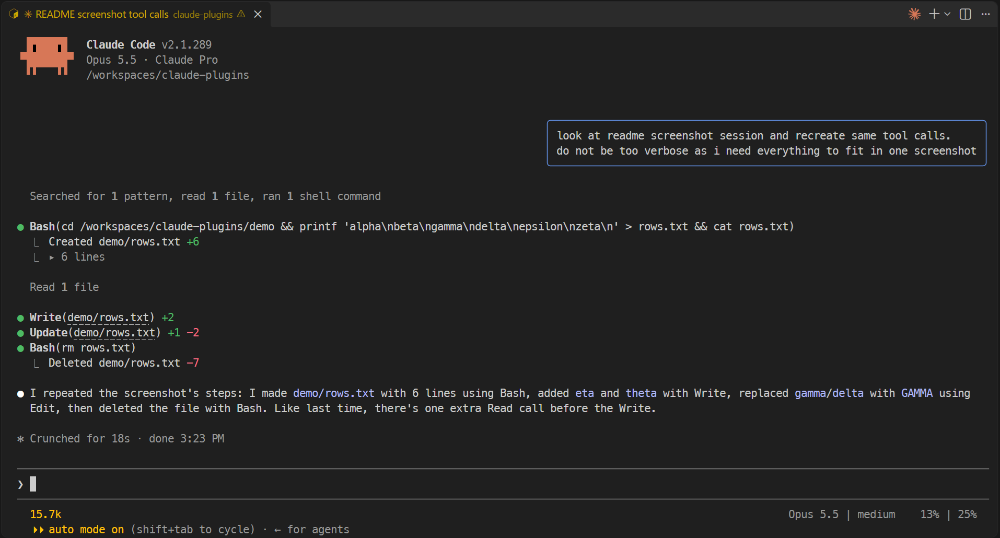
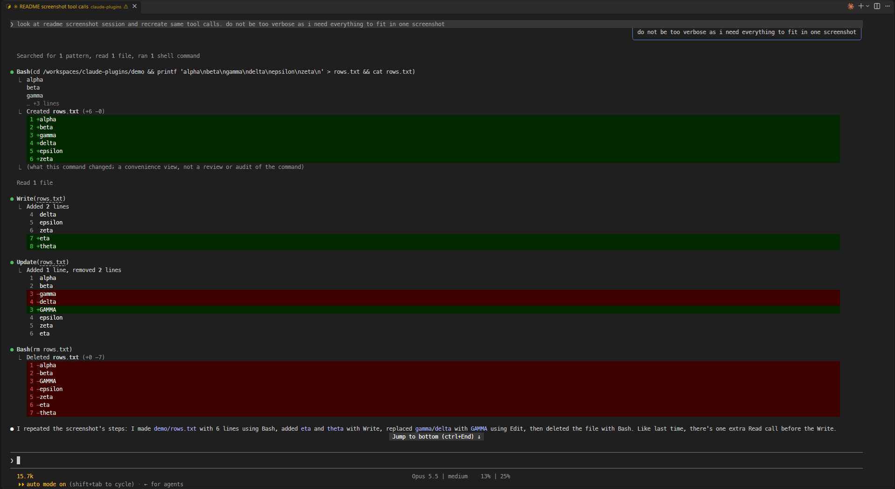

# claude-plugins

Claude Code plugins that change how the terminal UI looks. They only change rendering: what the model sees and does is untouched.

## Install

From your shell:

```
claude plugin marketplace add akilin/claude-plugins
claude plugin install better-tool-rows@akilin-plugins
claude plugin install prompt-bubbles@akilin-plugins
```

Then run `/reload-plugins` in any open session, or restart it.

## Update

From your shell:

```
claude plugin update better-tool-rows@akilin-plugins
claude plugin update prompt-bubbles@akilin-plugins
```

Then run `/reload-plugins` in any open session, or restart it. `/plugin marketplace update akilin-plugins` alone only refreshes the plugin list and leaves installed plugins as they are.

To get updates automatically, open `/plugin` → Marketplaces → `akilin-plugins` → Enable auto-update.

## Screenshots

With both plugins:



The same session without them (zoomed out to fit on one screen):



## Plugins

### better-tool-rows

Shorter, quieter tool rows.

- **Read / Edit / Write** show the file path relative to the folder Claude Code was started in (the link behind it still holds the full path, so ctrl+click opens it from anywhere), even after Claude `cd`s elsewhere or `/cd` moves the project. Files outside the folder keep their full path. Windows paths match with either separator and in any case. In a VS Code dev container or codespace the `file://` link is left off, since VS Code would open it on the machine outside the container; ctrl+click on the path then uses VS Code's own link, which opens the file inside.
- **Edit / Write** hide the diff and put the line counts on the row instead: `Update(notes.md) +3 -1`. A path too long to fit on the line with its counts is cut to its end (`Update(…/src/notes.md) +3 -1`), still opening the full path on ctrl+click. An edit held for review rather than written is shown as usual.
- A tool row straight after a one-line **Edit / Write** row drops the blank line above it, so a run of edits reads as a list. After text, or after a row with lines beneath it (Bash output, Read's `Read 7 lines`), the blank line stays.
- **Bash** commands are put on one line (a multi-line command's lines are joined) and cut with `…` so `Bash(command)` always fits on one line, wide characters included.
- **Bash** commands that create, delete or edit files list each one beneath the row with its line counts (`Created notes.md +10`, `Deleted notes.md -10`, `Updated notes.md +1 -1`) instead of a diff.
- **Bash** output longer than 5 lines is folded behind a clickable `▸ 12 lines`; unfolded, it shows up to 500 lines and counts the rest. If the command was cut or joined, the fold also holds the full command with syntax highlighting (`▸ command, 12 lines`); with 5 lines of output or fewer, the output stays as it is and the fold holds the command alone (`▸ command`).

### prompt-bubbles

Your own prompts are drawn as right-aligned chat bubbles (a rounded box with a cornflower-blue border, as wide as the longest line and at most three quarters of the terminal) so they stand apart from Claude's replies. Task notifications and messages from other agents or sessions keep the usual drawing, and so does the desktop app, which already has bubbles.

## Development

The repo has a dev container (Node, TypeScript and Claude Code preinstalled). It keeps Claude Code's config in a volume of its own, so logins and settings survive a rebuild, and sets VS Code's chat to auto-approve tool calls (`chat.permissions.default`), which is only safe inside the container.

From a plugin's folder (e.g. `plugins/better-tool-rows`):

```
claude plugin validate .
claude plugin test .
npx -y -p typescript tsc -p tsconfig.json
```

`tsc` needs the API types Claude Code writes to `.claude-plugin/types/` (gitignored) when it loads the plugin, so on a fresh clone load it once first, e.g. `claude --plugin-dir plugins/better-tool-rows`.

## License

MIT
